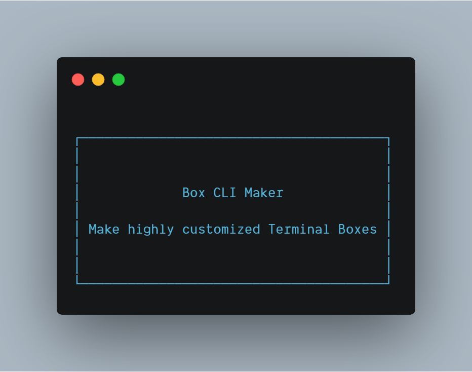
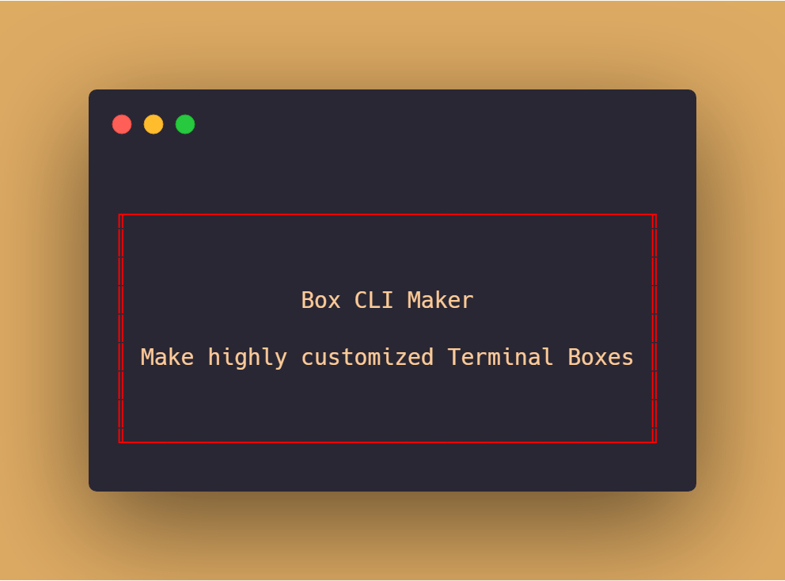
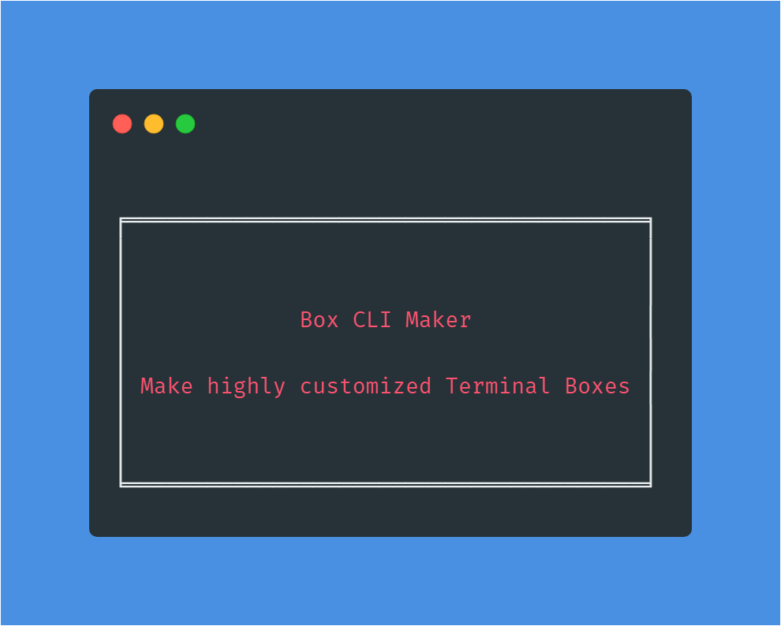
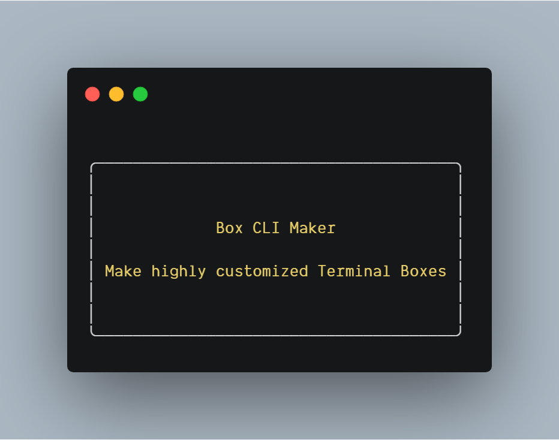
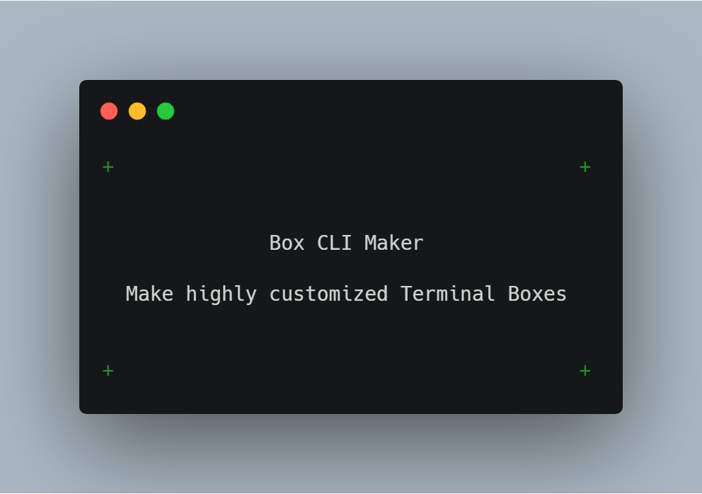
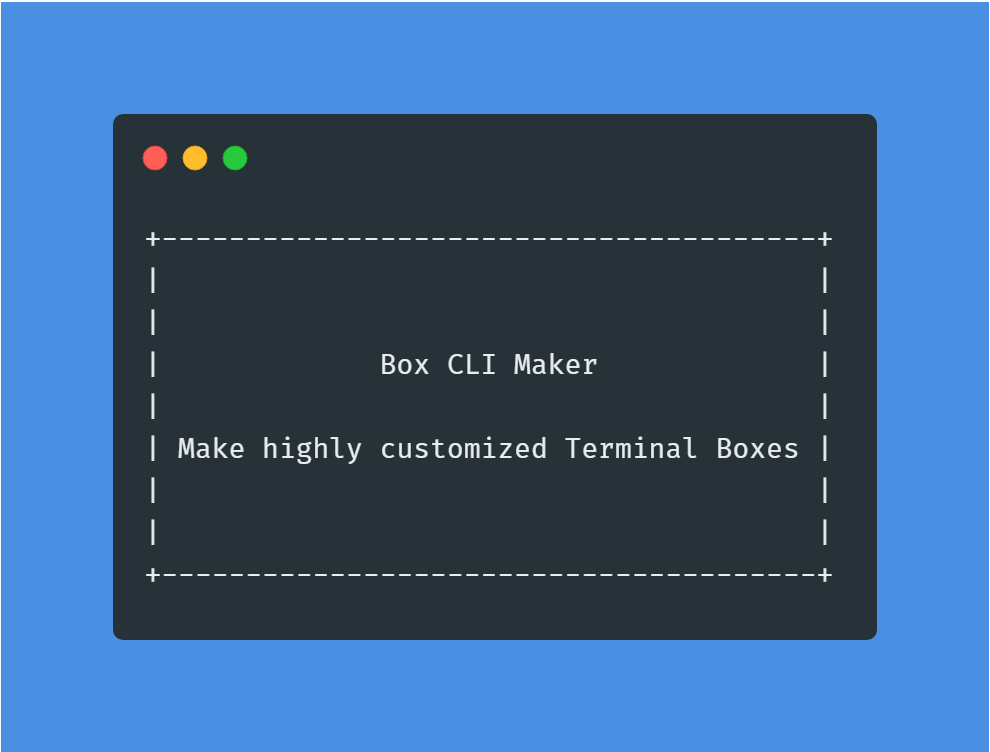
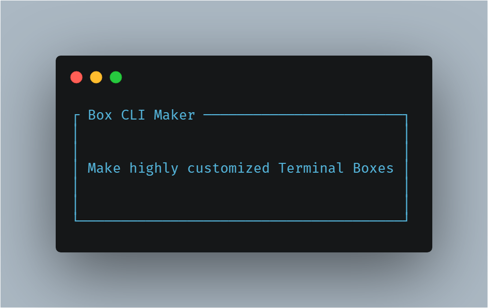
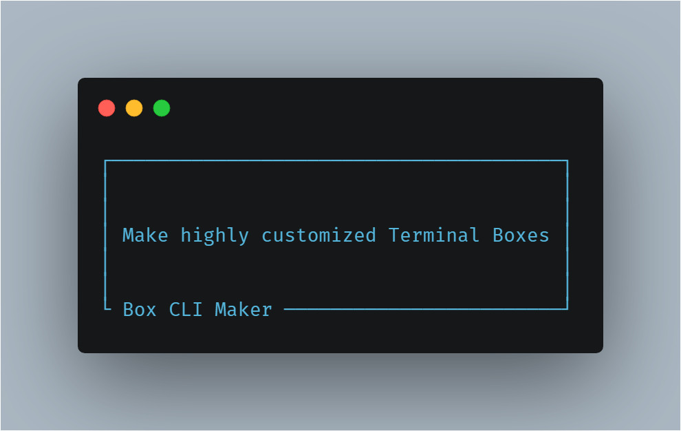
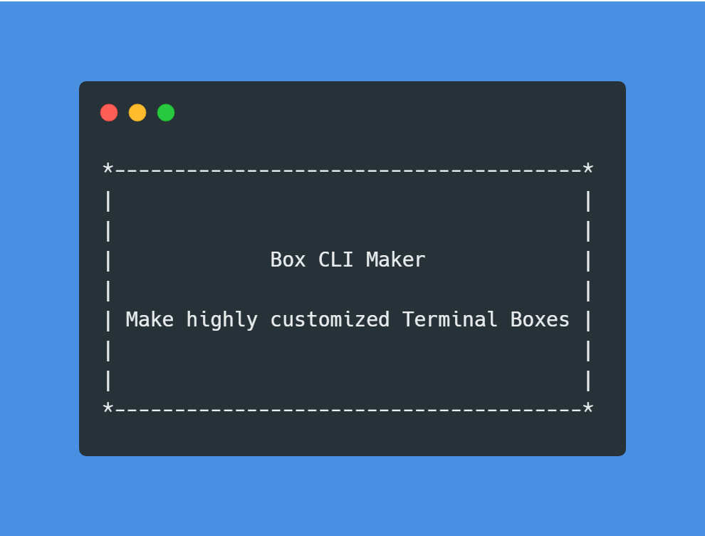

# Box CLI Maker 📦

[](https://pkg.go.dev/github.com/Delta456/box-cli-maker)
[](https://actions-badge.atrox.dev/Delta456/box-cli-maker/goto?ref=master)
[](https://goreportcard.com/report/github.com/Delta456/box-cli-maker)


Box CLI Maker is a Highly Customized Terminal Box Creator.

## Features

- Make terminal box in 8️⃣ inbuilt different style
- Custom Title Positions
- Make your own Box style 📦
- Align the text according to the need
- Written in  🇬 🇴

## Installation

```terminal
 go get github.com/Delta456/box-cli-maker
```

## Usage

In `main.go`

```go
package main

import (
 "github.com/Delta456/box-cli-maker" 
)

func main() {
    Box := box.New(box.Config{Px: 2, Py: 5, Type: "Single" })
    Box.Print("Box CLI Maker", "It is a highly customized terminal Box Maker")
}
```

`box.New(config Config)` accepts a Config struct with following parameters.

- Parameters
  - `Px` : Horizontal Padding
  - `Py` : Vertical Padding
  - `ContentAlign` : Align content in the Box i.e. `Center`, `Left` and `Right`
  - `Type`: Type of Box (listed down below)
  - `TitlePos` : Position of the Title i.e. `Inside`, `Top` and `Bottom`

`box.Print(title, lines string)` prints Box from the specified arguements.

- Parameters
  - `title` : Title of the Box
  - `lines` : Content written inside the Box

`box.Println(title, lines string)` prints Box in a newline from the specified arguements.

- Parameters
  - `title` : Title of the Box
  - `lines` : Content written inside the Box
 
`box.String(title, lines string) string` return `string` representation of Box.

- Parameters
  - `title` : Title of the Box
  - `lines` : Content written inside the Box

### Box Types

- `Single`



- `Single Double`



- `Double`


- `Double Single`



- `Bold`


- `Round`



- `Hidden`



- `Classic`



### Title Positions

- `Inside`


- `Top`



- `Bottom`



### Making custom Box

You can make your custom Box by using the inbuilt Box struct provided by the module.

```go
type Box struct {
	TopRight    string // TopRight corner used for Symbols
	TopLeft     string // TopLeft corner used for Symbols
	Vertical    string // Symbols used for Vertical Bars
	BottomRight string // BottomRight corner used for Symbols
	BottomLeft  string // BotromLeft corner used for Symbols
	Horizontal  string // Symbols used for Horizontal Bars
	Con      Config // Configuration for the Box to be made
}
```

```go
box := Box{TopRight: "*", TopLeft: "*", BottomRight: "*", BottomLeft: "*", Horizontal: "-", Vertical: "|", Con: Config{Px: 2, Py: 3, Type: "", TitlePos: "Inside"}}
box.Print("Custom Box", "This is a custom Box and it works well")
```

Output:



### Note

As different terminals have different font by default so the right vertical alignment may not be aligned well. You will have to change your font accordingly to make it work.

### Acknowledgements

I thank the following people and their packages whom I have studied and was able to port to Go accordingly.

- [thecodrr/boxx](https://github.com/thecodrr/boxx)
- [Atrox/box](https://github.com/Atrox/box)
- [sindreorhus-cli-boxs](https://github.com/sindresorhus/cli-boxes)

### License

Licensed under [MIT](LICENSE)
