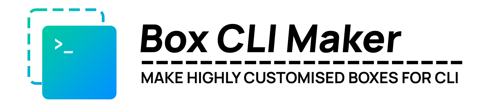

<hr/>
<div align="center">

</div>
<hr/>
<br/>
<div align="center">

[](https://pkg.go.dev/github.com/Delta456/box-cli-maker/v2)
[](https://godocs.io/github.com/Delta456/box-cli-maker/v2)
[](https://github.com/Delta456/box-cli-maker/actions?query=workflow%3A"Box+CLI+Maker")
[](https://goreportcard.com/report/github.com/Delta456/box-cli-maker)
[](https://golangci.com/r/github.com/Delta456/box-cli-maker)
[](https://github.com/Delta456/box-cli-maker/releases)
[](https://github.com/avelino/awesome-go)

</div>

## Features

- Make a Terminal Box in 8️⃣ inbuilt different styles
- 16 Inbuilt Colors and True Color Support 🎨
- Custom Title Positions 📏
- Make your Terminal Box style 📦
- Support for ANSI, Tabbed, Multi-line and Line Wrapping boxes 📑
- Align the text according to your needs 📐
- Unicode, Emoji and [Windows Console](https://en.wikipedia.org/wiki/Windows_Console) Support 😋
- Written in 🇬 🇴

## Installation

```terminal
 go get github.com/Delta456/box-cli-maker/v2
```

## Usage

In `main.go`

```go
package main

import "github.com/Delta456/box-cli-maker/v2"

func main() {
 Box := box.New(box.Config{Px: 2, Py: 5, Type: "Single", Color: "Cyan"})
 Box.Print("Box CLI Maker", "Highly Customized Terminal Box Maker")
}
```

`box.New(config Config)` takes Box `Config` and returns a `Box` from the given `Config`.

- Parameters
  - `Px` : Horizontal Padding
  - `Py` : Vertical Padding
  - `ContentAlign` : Content Alignment inside Box i.e. `Center`, `Left` and `Right`
  - `Type`: Box Type
  - `TitlePos` : Title Position of Box i.e. `Inside`, `Top` and `Bottom`
  - `Color` : Box Color
  - `TitleColor` : Title Color
  - `ContentColor` : Content Color
  - `AllowWrapping`: Flag to allow custom `Content` wrapping
  - `WrappingLimit`: Wrap the `Content` up to the Limit

### `Box` Methods

`Box.Print(title, lines string)` prints Box from the specified arguments.

- Parameters
  - `title` : Box Title
  - `lines` : Box Content

`Box.Println(title, lines string)` prints Box in a newline from the specified arguments.

- Parameters
  - `title` : Box Title
  - `lines` : Box Content

`Box.String(title, lines string) string` returns `string` representation of Box.

- Parameters
  - `title` : Box Title
  - `lines` : Box Content

### Box Types

- `Single`

<p align="center" style="margin-top: 30px; margin-bottom: 20px;">

</p>

- `Single Double`

<p align="center" style="margin-top: 30px; margin-bottom: 20px;">

</p>

- `Double`

<p align="center" style="margin-top: 30px; margin-bottom: 20px;">

</p>

- `Double Single`
<p align="center" style="margin-top: 30px; margin-bottom: 20px;">

</p>

- `Bold`

<p align="center" style="margin-top: 30px; margin-bottom: 20px;">

</p>

- `Round`

<p align="center" style="margin-top: 30px; margin-bottom: 20px;">

</p>

- `Hidden`

<p align="center" style="margin-top: 30px; margin-bottom: 20px;">

</p>

- `Classic`

<p align="center" style="margin-top: 30px; margin-bottom: 20px;">

</p>

### Title Positions

- `Inside`

<p align="center" style="margin-top: 30px; margin-bottom: 20px;">

</p>

- `Top`

<p align="center" style="margin-top: 30px; margin-bottom: 20px;">

</p>

- `Bottom`

<p align="center" style="margin-top: 30px; margin-bottom: 20px;">

</p>

### Custom Box

A Custom Box can be created by using the built-in Box struct provided by the module.

```go
type Box struct {
  TopRight    string // TopRight Corner Symbols
  TopLeft     string // TopLeft Corner Symbols
  Vertical    string // Vertical Bar Symbols
  BottomRight string // BottomRight Corner Symbols
  BottomLeft  string // BottomLeft Corner Symbols
  Horizontal  string // Horizontal Bar Symbols
  Config             // Box Config
}
```

#### Usage

In `main.go`:

```go
package main

import "github.com/Delta456/box-cli-maker/v2"

func main() {
    config := box.Config{Px: 2, Py: 3, Type: "", TitlePos: "Inside"}
    boxNew := box.Box{TopRight: "*", TopLeft: "*", BottomRight: "*", BottomLeft: "*", Horizontal: "-", Vertical: "|", Config: config}
    boxNew.Println("Box CLI Maker", "Make Highly Customized Terminal Boxes")
}
```

<p align="center" style="margin-top: 30px; margin-bottom: 20px;">

</p>

More examples can be found in the `examples/` folder.

### Color Types

Color support is provided by the [gookit/color](https://github.com/gookit/color) module from which it uses `FgColor` and `FgHiColor`. `Color` is a key for the following maps:

```go
 fgColors map[string]color.Color = {
  "Black":   color.FgBlack,
  "Blue":    color.FgBlue,
  "Red":     color.FgRed,
  "Green":   color.FgGreen,
  "Yellow":  color.FgYellow,
  "Cyan":    color.FgCyan,
  "Magenta": color.FgMagenta,
  "White":   color.FgWhite,
}

 fgHiColors map[string]color.Color = {
  "HiBlack":   color.FgDarkGray,
  "HiBlue":    color.FgLightBlue,
  "HiRed":     color.FgLightRed,
  "HiGreen":   color.FgLightGreen,
  "HiYellow":  color.FgLightYellow,
  "HiCyan":    color.FgLightCyan,
  "HiMagenta": color.FgLightMagenta,
  "HiWhite":   color.FgLightWhite,
}
```

If you want High-Intensity Colors then the Color name must start with `Hi`. If the Color option is empty or invalid then no colour is applied.

1. True Color is also possible though you need to provide it either as `uint` or `[3]uint`.

2. `[3]uint`'s elements all must be in a range of `[0, 0xFF]` and `uint` in range of `[0x000000, 0xFFFFFF]`.

As a convenience, if the terminal doesn't support True Color then it will round off according to the terminal's max supported colours which makes it easier for the users not to worry about other terminals in most cases.

Here's a list of 24-bit [supported terminals](https://gist.github.com/XVilka/8346728) and 8 bit [supported terminals](https://fedoraproject.org/wiki/Features/256_Color_Terminals).

This module also enables **True Color** and **256 Colors** support on Windows Console through [Virtual Terminal Processing](https://docs.microsoft.com/en-us/windows/console/console-virtual-terminal-sequences) but you need to have at least [Windows 10 Version 1511](https://en.wikipedia.org/wiki/Windows_10_version_history_(version_1511)) for 256 colors or [Windows 10 Version 1607](https://en.wikipedia.org/wiki/Windows_10_version_history_(version_1607)) for True Color Support.

4-bit Colors are now standardized so they should be supported by all Terminals now.

If `ConEmu` or `ANSICON` is installed for Windows systems then it will also be detected. It is highly recommended to use the latest versions of both of them to have the best experience.

### Content Wrapping

This library allows the usage of custom wrapping of `Content` so that the Box formed will be created according to your own needs.

To enable this `Config.AllowWrapping` must be set to `true` plus you can also provide your own wrapping limit via `Config.WrappingLimit` which has a default value of `2*TermWidth/3` where `TermWidth` is the current terminal's width.

### Note

#### 1. Vertical Alignment

As different terminals have different fonts by default, the right vertical alignment may not be aligned well. You will have to change your font accordingly to make it work.

#### 2. Limitations of Unicode and Emoji

It uses [mattn/go-runewidth](https://github.com/mattn/go-runewidth) for Unicode and Emoji support though there are some limitations:

- `Windows Terminal`, `ConEmu` and `Mintty` are the only known terminal emulators which can render Unicode and Emojis properly on Windows.
- Indic Text only works on very few Terminals.
- It is recommended not to use this for Online Playgrounds like [`Go Playground`](https://play.golang.org/) and [`Repl.it`](https://repl.it), `CI/CDs` etc. because they use a font that only has ASCII support and other Character Sets are used, which becomes problematic for finding the length as the font changes at runtime.
- Some changes may be needed to your font which supports Unicode and Emojis else the right vertical alignment may likely break.

#### 3. Terminal Color Detection

It is possible to round off True Color provided to 8-bit or 4-bit according to your terminal's maximum capacity.

There is no **standardized way** of detecting the terminal's maximum color capacity so the way of detecting your terminal might not work for you. If you have a fix for your terminal then you can always make a PR.

The following two points are only applicable for **Unix** systems:

- If the module can't detect the True Color of the terminal then your environment variable `COLORTERM` must be changed to `truecolor` or `24bit` for True Color support.

- If Targetting 8-bit color-based terminals and the module couldn't detect it, then the environment variable `TERM` must be set to the name of the terminal emulator with `256color` as a suffix like `xterm-256color`.

There might be no color effect for very old terminals like [`Windows Console (Legacy Mode)`](https://docs.microsoft.com/en-us/windows/console/legacymode) or `TERM` environment variable which gives `DUMB` so the module will output some garbage value or a warning if used.

It is **not** recommended to use this module with color effect in `Online Playgrounds`, `CI/CD`, `Browsers` etc, as few may support color and this is hard to detect in general. If there is a possible way, then open an issue and address the solution!

#### 4. Tabs

This library supports the usage of tabs but their use should be limited.

### Projects using Box CLI Maker

-  [kubernetes/minikube](https://github.com/kubernetes/minikube): Run Kubernetes locally.
- +[Many More](https://pkg.go.dev/github.com/Delta456/box-cli-maker/v2?tab=importedby)!

### Acknowledgements

I thank the following people and their packages whom I have studied and was able to port to Go accordingly.

- [thecodrr/boxx](https://github.com/thecodrr/boxx)
- [Atrox/box](https://github.com/Atrox/box)
- [sindreorhus-cli-boxes](https://github.com/sindresorhus/cli-boxes)

Also special thanks to [@elimsteve](https://github.com/elimisteve) who helped me to optimize the code and told me the best possible ways to fix my problems, [@JalonSolov](https://github.com/JalonSolov) for tab lines support and [Kunal Raghav](https://github.com/KunalRaghav) for making the library's logo.

Kudos to [moul/golang-repo-template](https://github.com/moul/golang-repo-template) for their Go template.

### License

Licensed under [MIT](LICENSE)
